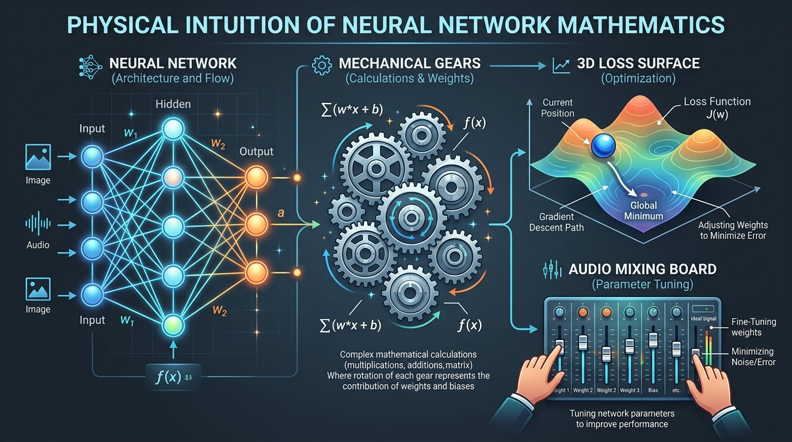
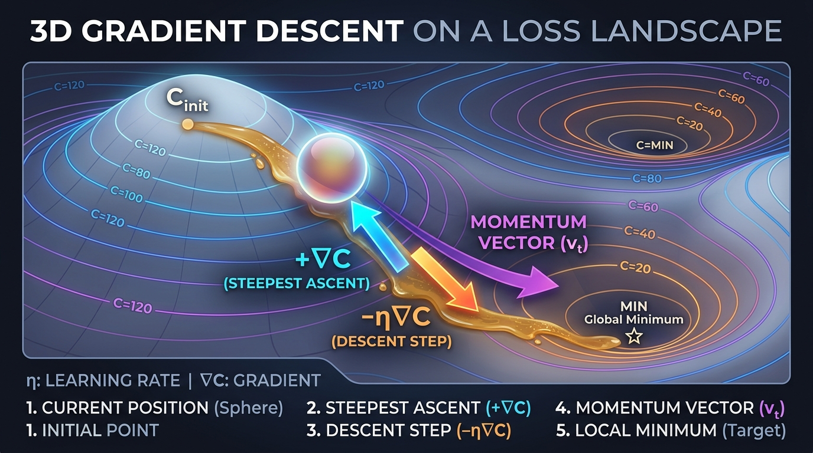
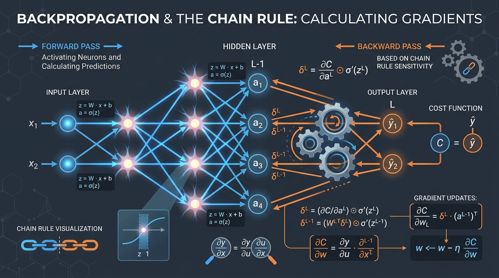

# Mathematics of Neural Networks — Visual &amp; Interactive Study Guide

A static, seven-chapter visual and interactive guide to the complete mathematics of feed-forward neural networks and
backpropagation. Zero build step, zero dependencies, responsive light/dark themes, and ready for GitHub Pages.

🌐 **Live Website:** [https://abusuraihsakhri.github.io/mathematics-of-neural-networks/](https://abusuraihsakhri.github.io/mathematics-of-neural-networks/)

<p align="center">
  
</p>

---

## 🏛️ The Three Pillars of Neural Network Mathematics

Deep learning is often mistaught as a collection of heuristic recipes or purely single-variable calculus tricks. In reality, the mathematical engine powering artificial neural networks rests upon three deeply unified pillars:

1. **Linear Algebra &amp; High-Dimensional Geometry:**
   - **Affine Coordinate Transforms:** Neural layers map vectors across spaces via $z = W\mathbf{x} + \mathbf{b}$, geometrically rotating, shearing, stretching, and contracting feature manifolds.
   - **Dimension Accounting &amp; Matrix Contractions:** Exact tracking of inner products, tensor shapes, and destination-first indexing ($W_{jk}$ connecting input $k$ to destination $j$) eliminates matrix transpose errors.
2. **Multivariable Calculus &amp; Matrix Analysis:**
   - **Vector &amp; Matrix Derivatives:** Generalizing scalar slopes to gradients ($\nabla_{\mathbf{x}} f$) and Jacobians ($J \in \mathbb{R}^{m \times n}$) measuring local geometric distortion.
   - **Computational Graph Chain Rule:** Systematic backward push of adjoint sensitivity vectors through transposed Jacobians ($J^\top$), culminating in the four master equations of backpropagation (BP1–BP4).
3. **Non-Convex Optimization &amp; Information Geometry:**
   - **Loss Surface Physics:** Curvature, condition numbers ($\kappa = \lambda_{\max}/\lambda_{\min}$), and learning rate stability boundaries ($\eta < 2/\lambda_{\max}$).
   - **Dynamics &amp; Noise:** Heavy-ball momentum simulating viscous friction, mini-batch sampling noise escaping high-dimensional saddle points, and cross-entropy information log-likelihoods.

---

### 📚 How People Can Study From It

1. **Zero-Setup Learning:**
   Students do not need Python, PyTorch, CUDA, or Docker installed. They simply open your link in Chrome, Safari, Firefox, or Edge. All 14 interactive simulators, matrix visualizers, and physics sandboxes execute locally in the browser with zero build steps, zero latency, and zero installation barrier.

2. **Study Workflow for Students:**
   - • **Start with the Storyboard Strips:** Look at the 3-panel comics at the top of each chapter to grasp the physical intuition first (interlocking gears, hydraulic pressure valves, audio mixing consoles, rolling marbles).
   - • **Play with the Simulators:** Move the sliders on the Audio Mixer, Mechanical Gears, Hydraulic Valves, and Loss Surface Arena to feel the numbers change in real time.
   - • **Read the Visual Formula Decoders:** Learn the equations through color-coded plain-English callouts before reading the step-by-step mathematical derivations.
   - • **Test Themselves:** Complete the interactive self-check quizzes at the end of every chapter with instant reveal explanations.

---

## What's Inside

Every chapter features:
1. **In Simple Terms (The Big Picture):** Plain-English conceptual summaries before diving into formal matrix calculus.
2. **Physical Intuition Callouts:** Real-world physical metaphors (audio mixing consoles, hikers in fog, stretched rubber sheets, interlocking gear trains, spring relief valves, electrical diodes, rolling marbles in viscous honey, corporate blame delegation).
3. **Responsive Visual Diagrams:** Inline vector SVGs illustrating signal propagation, tensor dimensions, gradient fields, and error waterfalls that adapt to light and dark themes.
4. **Interactive Simulators & Sandboxes:** Real-time HTML5 canvases and dynamic widgets to probe formulas, perturb weights, and observe learning dynamics firsthand.

## Contents

| Chapter | Core Concepts | Visual &amp; Physical Intuition | Interactive Module |
|---|---|---|---|
| **1. Foundations and notation** | Composed functions, parameter spaces, destination-first indexing | Audio mixing console &amp; balance sliders; Function pipeline diagram | **Network Architecture &amp; Shape Builder** (dynamic SVGs &amp; layer shaping) |
| **2. The matrix calculus toolkit** | Gradients, Jacobians, chain rules, Hadamard derivatives | Foggy mountain hiker; Stretched rubber sheets; Interlocking gear trains | **2D Gradient Vector Field** &amp; **Jacobian Space Deformer Canvas** |
| **3. Neurons, layers, forward propagation** | Affine maps, non-linearities, matrix forward pass, MSE cost | Water pipes &amp; spring-loaded relief valves; Matrix broadcast diagram | **Activation Function &amp; Tangent Slope Explorer** (ReLU, Sigmoid, Tanh) |
| **4. Differentiating a single neuron** | Single-neuron gradients, dying ReLU, feature scaling | Mechanical levers; Electrical diodes &amp; blown fuses; Ravine geometry | **Chain Rule Microscope &amp; Perturbation Probe** (numerical gradient checker) |
| **5. Gradient descent** | Steepest descent, learning rates, batch vs mini-batch vs SGD | Rolling marble in viscous honey &amp; momentum; 4 learning rate regimes | **2D Loss Surface &amp; Physics Arena** + **1-D Stability Explorer** |
| **6. Backpropagation** | Reverse-mode AD, node errors $\delta$, BP1–BP4 derivations | Corporate blame chain &amp; megaphone; Vanishing gradient waterfall | **Step-by-Step Backprop Stepper** + **XOR Lab with 2D Decision Boundary** |
| **7. Reference** | Notation ledger, shape cheat sheet, master formulas, glossary | Master tensor dimension &amp; matrix contraction cheat sheet | **Interactive Tensor Shape &amp; Parameter Calculator** |

Each chapter ends with self-check questions whose answers are collapsed until you commit to one.

## Complete Interactive Suite (14 Hands-On Simulators)

1. **The 60-Second Neural Sandbox** (`index.html`) — Live forward pass, analytical gradients, and single-step gradient descent updates.
2. **Interactive Audio Mixing Console Simulator** (`01-foundations.html`) — 3 channel track faders, gain knobs, master bias trim, limiter modes, and live 16-segment LED VU-meter.
3. **Network Architecture &amp; Shape Builder** (`01-foundations.html`) — Real-time layer topology, signal pulsing, and parameter counting.
4. **2D Contour &amp; Vector Field Explorer** (`02-matrix-calculus.html`) — Draggable coordinate puck tracking $\nabla f$ (ascent) and $-\nabla f$ (descent).
5. **Jacobian Space Deformer Canvas** (`02-matrix-calculus.html`) — Live $2 \times 2$ Jacobian matrix deformation of unit circles with $\det(J)$ volume scaling.
6. **Interlocking Mechanical Gear Train Simulator** (`02-matrix-calculus.html`) — Live spinning gears physically demonstrating how intermediate gear teeth cancel out in the Chain Rule.
7. **Hydraulic Water Pipe &amp; Relief Valve Simulator** (`03-networks-as-equations.html`) — Water pressure manifold showing how constriction valves and spring relief gates model ReLU and Sigmoid firing.
8. **Activation Function &amp; Tangent Slope Explorer** (`03-networks-as-equations.html`) — Interactive comparison of ReLU, Leaky ReLU, Sigmoid, and Tanh with tangent slopes.
9. **Single-Neuron Chain Rule Microscope** (`04-neuron-derivatives.html`) — Dynamic chain rule factorization, dying ReLU toggle, and Taylor finite-difference checking.
10. **2D Loss Surface &amp; Physics Optimization Arena** (`05-gradient-descent.html`) — Rolling marble physics on an anisotropic ravine with learning rate $\eta$, momentum $\beta$, and mini-batch noise.
11. **1-D Gradient Descent Stability Sandbox** (`05-gradient-descent.html`) — Interactive exploration of quadratic convergence, oscillation, and divergence ($\eta < 2/C''$).
12. **Step-by-Step Backpropagation Walkthrough** (`06-backpropagation.html`) — Interactive walkthrough stepping through forward pass, BP1, BP2, BP3, BP4, and parameter updates with animated nodes/edges.
13. **Enhanced XOR Laboratory** (`06-backpropagation.html`) — Real-time neural network training with simultaneous loss trajectory curve and 2D decision boundary heatmap.
14. **Tensor Shape &amp; Network Dimension Calculator** (`07-reference.html`) — Live tensor shape matrix validator preventing shape mismatches.

## Visual Intuition Tools (No Math Fear)

- **Pictorial Storyboard Strips:** 3-step illustrated comic strips on every page showing the concepts in simple real-world metaphors before entering the algebra.
- **Visual Formula Decoders:** High-contrast annotated cards breaking down equations into color-coded boxes with everyday plain-English definitions.
- **Physical Analogy Grids:** Side-by-side comparative tables mapping physical systems (audio consoles, water valves, gear trains, levers, rolling marbles, corporate hierarchies) directly to their mathematical formulas.

### 🏔️ 3D Loss Surface Descent
<p align="center">
  
</p>

### 🔄 Backpropagation &amp; The Chain Rule Flow
<p align="center">
  
</p>

## Structure

```text
mathematics-of-neural-networks/
├── index.html              landing page, 60-second sandbox & course roadmap
├── chapters/
│   ├── 01-foundations.html
│   ├── 02-matrix-calculus.html
│   ├── 03-networks-as-equations.html
│   ├── 04-neuron-derivatives.html
│   ├── 05-gradient-descent.html
│   ├── 06-backpropagation.html
│   └── 07-reference.html
├── css/style.css           design tokens, light/dark themes, responsive layout, cards
├── js/main.js              theme manager, progress bar, scrollspy, and all 14 simulators
├── assets/                 high-resolution visual infographics and diagrams
├── README.md
├── LICENSE
└── .nojekyll
```

`js/main.js` is loaded by every page and each of its modules is guarded by an existence check, so a
page that lacks a given widget simply skips it.

## Run locally

```bash
python -m http.server 8000
```

Then open `http://localhost:8000`. Opening `index.html` directly from your browser filesystem also works immediately.

## GitHub Pages Deployment

1. Repository URL: `https://github.com/abusuraihsakhri/mathematics-of-neural-networks`
2. **Settings → Pages**, deploy from branch `main`, folder `/ (root)`.
3. Live Site URL:
   👉 **[https://abusuraihsakhri.github.io/mathematics-of-neural-networks/](https://abusuraihsakhri.github.io/mathematics-of-neural-networks/)**

MathJax loads from jsDelivr and fonts from Google Fonts; both degrade cleanly to system fallbacks offline. Everything else is 100% local.

## Licence

MIT. See `LICENSE`.
